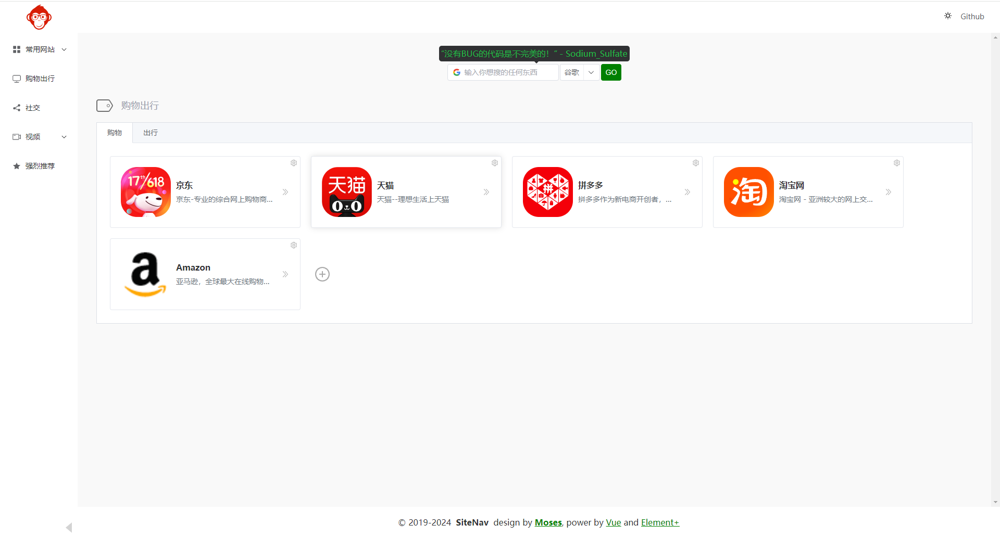

# 一站式互联网导航
人人都可以拥有属于自己的导航网站

一个基于 [Vue3](https://vuejs.org) + [Element Plus](https://element-plus.org) 的静态响应式网址导航

# SiteNav
📷


# 快速构建属于自己的网址导航

## 方法一， 直接在 UI 上添加删除修改
1. 右击菜单图标 - 添加修改编辑导航菜单

2. 右击标签名 - 添加修改编辑导航便签

3. 点击 + 或点击设置图标 - 添加修改编辑网站


## 方法二， 配置数据，自己部署

如果您拥有一定的编程背景和构建站点的经验，可以使用此方法，快速修改数据，然后部署。

1 数据配置在 [api/data](/api/data/)，包含
- 左侧菜单
- 搜索可选项
- 主页面网页导航地址信息

2 通过开发构建生成部署文件

3 部署到服务器上

# 数据安全性
数据都只存储在浏览器本地，未作任何数据上传

# 如何开发使用

1. 安装 Node 和 NPM，具体细节请询问 ChatGPT；
2. 获取本源码，并进入到源码根目录

```shell
git clone git@github.com:MosesCN/SiteNav.git
```

3. 编译调试

```shell
npm install
npm run dev
```
4. 构建生成版本
```shell
npm run build
```

# TODO

- [X] 简易管理端 - 人人都可以拥有属于自己的导航网站
- [ ] 从书签中导入
- [ ] 多端共享配置
- [X] 多屏适配 - 菜单栏，底部 Copyright，每日一句
- [ ] 封装组件读取 Local SVG
- [ ] 站内搜索
- [ ] 多语言支持 - Google Translate

# License

Copyright © 2017-2024 Released under the **MIT License** Made with ❤️ by Moses
